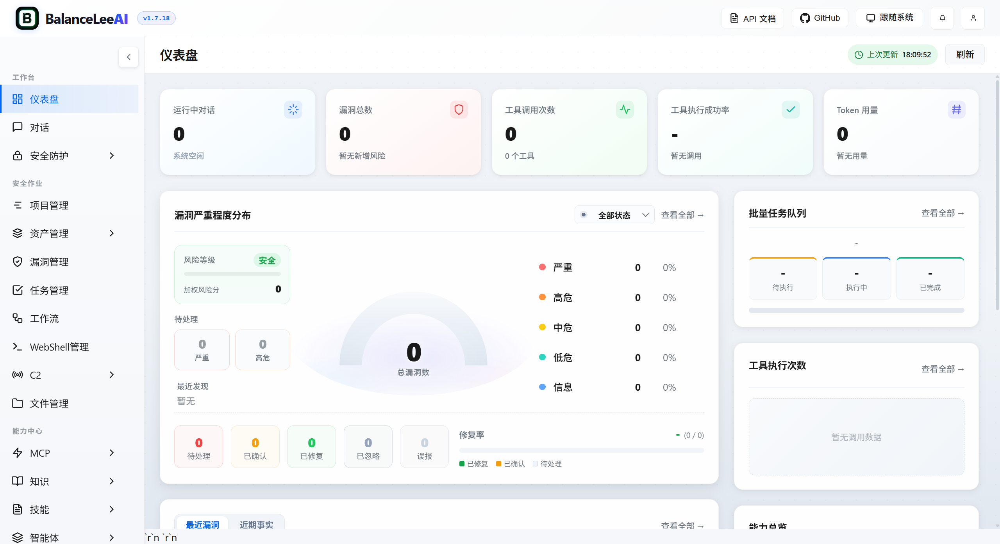
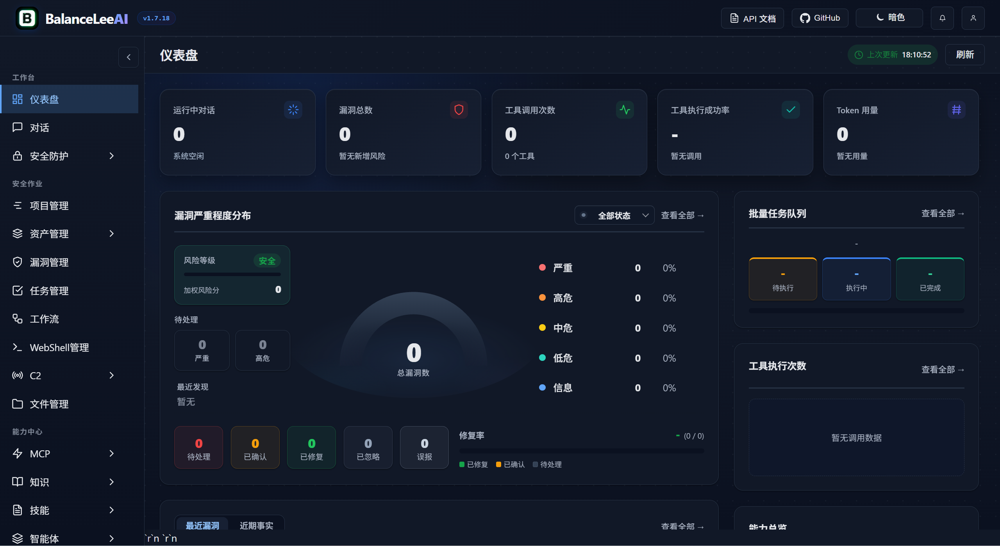

  

# BalanceLeeAI

[中文](README_CN.md) | [English](README.md)

### 系统仪表盘概览

<table>
<tr>
<td width="50%" align="center">
<strong>浅色模式</strong> 

</td>
<td width="50%" align="center">
<strong>深色模式</strong> 

</td>
</tr>
</table>
*仪表盘提供系统运行状态、安全漏洞、工具使用情况和知识库的全面概览，帮助用户快速了解平台核心功能和当前状态。<table>
